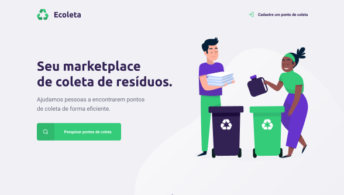
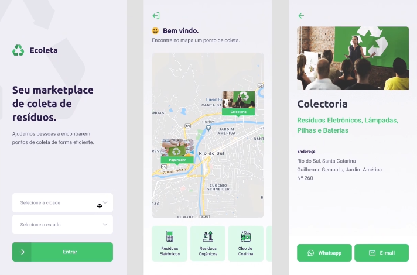

# Projeto da Semana Next Level Week #01

## Como testar
Os projetos utilizam o [Yarn](https://yarnpkg.com/) para o gerenciamento dos pacotes.

Utilize o ```git clone https://github.com/HidemitsuHashimoto/nlw-01.git``` e execute os comandos informados em cada projeto.

### Tecnologias comuns
- [Visual Studio Code](https://code.visualstudio.com/)
- [NodeJS](https://nodejs.org/en/)
- [Typescript](https://www.typescriptlang.org/)

# API com NodeJS

## Como testar
Primeiro baixe os pacotes utilizando o comando ```yarn```.

Depois de tudo atualizado utilize o comando ```yarn dev```.

## Cadastro de Items e Pontos de Coleta

### Tecnologias utilizadas
- [Knex](http://knexjs.org/)
- [Multer](https://github.com/expressjs/multer)
- [Celebrate](https://github.com/arb/celebrate)
- [Express](https://expressjs.com/pt-br/)
- [SQLite3](https://github.com/mapbox/node-sqlite3)


# Projeto web em ReactJS



## Como testar
Primeiro baixe os pacotes utilizando o comando ```yarn```.

Depois de tudo atualizado utilize o comando ```yarn start```.

### Tecnologias utilizadas
- [Axios](https://github.com/axios/axios)
- [Leaflet](https://leafletjs.com/)
- [React Icons](https://react-icons.github.io/react-icons/)
- [React Dropzone](https://react-dropzone.js.org/)
- [React Router Dom](https://reacttraining.com/react-router/web/guides/quick-start)


# Projeto modile em React Native



## Como testar
Primeiro baixe os pacotes utilizando o comando ```yarn```.

Depois de tudo atualizado utilize o comando ```yarn start```.

### Tecnologias utilizadas
- [Axios](https://github.com/axios/axios)
- [Expo](https://expo.io/)
- [React Navigation](https://reactnavigation.org/)
- [React Native Picker Select](https://github.com/lawnstarter/react-native-picker-select)